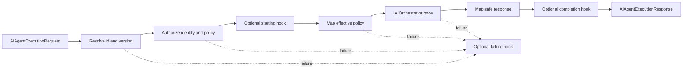

# AI Agent Framework

## Definition

The Agent Framework turns the existing AI engines into named, versioned application capabilities. An agent is a declarative `AIAgentDefinition` plus optional lifecycle hooks. It describes an objective and the maximum rights of one behavior; it does not contain an orchestration loop and does not receive `IServiceProvider`.

Every definition includes a canonical `AIAgentId`, semantic `AIAgentVersion`, availability, capabilities, permissions, scenarios, prompt policy, Memory policy, Knowledge policy, Tool policy, timeout, failure mode, side-effect ceiling, tags, and filtered public metadata.

## Lifecycle

`AIAgentExecutor` owns the stable states `Created`, `Resolving`, `Authorizing`, `Mapping`, `Executing`, `Completed`, `Failed`, `Cancelled`, and `TimedOut`. It resolves and authorizes before the provider can be reached, calls `IAIOrchestrator` once, and never retries automatically.



Hooks are intended for bounded domain-neutral observations around execution. They cannot replace validation, authorization, mapping, orchestration, security, or metrics. A failure in the failure hook is logged safely and cannot replace the primary exception.

## Registry and versioning

The in-memory registry snapshots all injected `IAIAgent` instances at construction. Duplicate id and version pairs fail startup. The snapshot is thread-safe because it is immutable after construction.

Ids use case-sensitive lowercase-kebab-case ASCII and a 64-character maximum. Versions use semantic ordering, including optional pre-release identifiers. `Exact`, `Latest`, and `LatestStable` selection avoid ambiguous resolution; `LatestStable` excludes pre-releases.

Discovery returns definitions only. It filters permissions, tenant, user, scenario, capabilities, tags, availability, development policy, and maximum side effect. Disabled agents are never discoverable.

## Authorization

Authorization receives explicit `AIAgentAuthorizationContext`; there is no `HttpContext` or `ClaimsPrincipal` dependency. The default authorizer checks agent availability, required permissions, optional tenant and user allowlists, supported scenario, requested capabilities, global side-effect boundary, timeout, and every override.

Missing permission, disabled availability, unsupported capability, tenant or user mismatch, and excessive side effect always fail closed. Reduced-capability continuation cannot alter these decisions.

## Policies and overrides

The definition is the upper bound. Requests may disable an optional engine or select a smaller budget when override is allowed. They cannot enable a forbidden engine, disable a required engine, increase a budget, weaken failure behavior, or add permissions.

Prompt policy controls template and version, optional static instruction, defaults, required variables, override permissions, and a character budget. `userMessage` is reserved and is injected once by the Prompt Engine.

Memory policy controls whether memory is permitted or required, maximum window, request window override, user and assistant saves, compaction, and failure behavior. Effective memory remains isolated by conversation, tenant, and user.

Knowledge policy controls whether retrieval is permitted or required, result count, score floor, character and token budgets, allowed filter names, explicit query policy, current-message fallback, citations, and failure behavior. The Agents project has no pgvector dependency.

Tool policy permits only explicit invocation of listed tool ids. It controls required permissions, scenario, side-effect ceiling, timeout, failure mode, and idempotency for write-capable calls. There is no model-selected or provider-native tool calling.

## Mapping and execution

`AIAgentRequestMapper` converts the definition and request into one `AIOrchestrationRequest`. It applies prompt defaults, request-scoped Memory options, Knowledge budgets, explicit Tool options, identity, session, conversation, correlation, and safe metadata. It validates policy again so direct mapper use cannot silently widen rights.

`AIAgentResponseMapper` converts the normalized orchestration response into `AIAgentExecutionResponse`. The public result includes agent id and version, execution ids, scenario, content, provider, state, UTC timing, public citation ids, optional tool id, engine-use booleans, token estimates, and phase durations.

The response excludes rendered prompts, Memory content, complete Knowledge fragments, tool arguments, complete tool output, stack traces, and internal metadata.

## Timeouts and failure modes

Timeout priority is request override, agent definition, then framework default. The result is capped by `MaximumExecutionTimeout` and implemented with `TimeProvider`. Caller cancellation propagates as `OperationCanceledException`; an agent deadline becomes `AIAgentTimeoutException`. Provider and tool errors keep their existing layer-specific semantics.

`FailClosed` stops execution. `ContinueWithReducedCapabilities` can only map optional Memory, Knowledge, or Tool policies to their established continue-without modes. Required context and every security failure remain fail-closed.

Metrics report resolution, authorization, mapping, orchestration, and total durations plus Prompt, Memory, Knowledge, and Tool use, provider, and available input/output token counts.

## Engine integration

- Prompt Engine renders the definition's provider-independent template and variables.
- Memory Engine accepts a request-scoped bounded window, save flags, compaction flag, and failure mode while preserving the legacy `UseMemory` contract.
- Knowledge RAG applies existing retrieval, budgeting, composition, and citation behavior.
- Tool Engine resolves and executes one explicitly named, authorized tool and composes only successful bounded output.
- AI orchestration remains responsible for ordered steps and the single provider call.

Register the framework after the orchestration components needed by the host:

```csharp
services.AddTradeMindAIOrchestration();
services.AddTradeMindMemory();
services.AddTradeMindKnowledgeRag();
services.AddTradeMindAIToolOrchestration();
services.AddTradeMindAIAgents();
```

The host may omit optional engines when its registered agents never enable them. Development definitions require `EnableDevelopmentAgents = true`; development tools have their own independent option.

## Built-in agents

`generic-assistant` `1.0.0` is the reference definition. It uses `generic-chat` `1.0`, permits optional Memory and Knowledge, and permits explicit `echo` and `add-numbers`. Its side-effect ceiling is `None`.

`trading-coach` `0.1.0` is a development-only educational skeleton. It uses a cautious prompt and has no Memory, Knowledge, tool, market, broker, portfolio, trading action, or side effect.

`trading-coach` `1.0.0` is the first functional business agent and is implemented by `TradeMind.Trading.Coaching`. It accepts only explicitly supplied journal data, applies deterministic validation, normalization, metrics, rule findings, and process scores before one provider call, parses strict JSON, merges with deterministic priority, and runs a fail-closed final safety filter. Memory and educational Knowledge are optional and degradable. Tools, streaming, provider-native tool calling, autonomous execution, market access, broker access, signals, and side effects are disabled. Prompt template `trading-coach-analysis` `1.0` is the Prompt Engine counterpart to agent semantic version `1.0.0`.

Business modules register additional `IAIAgent` versions and prompt templates through their own DI entry point. They do not move business validation or calculations into the generic Agent Framework.

## Limits and evolution

The registry is in memory and definitions are code-owned. This increment has no streaming, planner, autonomous loop, provider-native tool calling, multi-agent coordination, persistence, marketplace, HTTP API, UI, market data, broker, or real trading behavior.

A future autonomous loop must be a separate decision with step and cost budgets, explicit termination, repeated authorization, prompt-injection defenses, idempotency, and auditability. Multi-agent work additionally requires message ownership, delegation permissions, deadlock prevention, shared-context boundaries, and independent observability.
