# AI Orchestration

TradeMind AI orchestration is the provider-agnostic application pipeline that turns a logical product request into a normalized chat response.

It lives in `TradeMind.AI.Application` and depends on `TradeMind.AI.Abstractions`. It does not depend on OpenAI, provider infrastructure, EF Core, Npgsql, HTTP clients, or KnowledgeHub infrastructure.

## Objective

The orchestration layer gives future AI features one common flow for:

- structural request validation;
- prompt construction;
- provider capability checks;
- provider execution through `IChatProvider`;
- response normalization;
- structured operational logging;
- extension by future modules such as Memory and KnowledgeHub.

The layer does not implement persistent memory, RAG, streaming, tool calling, multi-agent behavior, or trading business rules.

## Public contracts

`IAIOrchestrator` exposes:

```csharp
Task<AIOrchestrationResponse> ExecuteAsync(
    AIOrchestrationRequest request,
    CancellationToken cancellationToken);
```

`AIOrchestrationRequest` carries an optional system instruction, user message, logical scenario, optional logical model, optional temperature, optional token limit, read-only metadata, optional session id, optional conversation id, optional correlation id, and optional identity context.

`AIOrchestrationResponse` carries session id, optional conversation id, correlation id, scenario, provider, model, text content, token usage, total duration, optional provider duration, executed steps, UTC completion date, execution state, and optional response id.

## Pipeline

Pipeline steps implement `IAIOrchestrationStep`. They are registered through dependency injection, sorted by `Order`, and executed sequentially.

```mermaid
flowchart LR
    Request["AIOrchestrationRequest"] --> Validation["RequestValidationStep"]
    Validation --> Prompt["PromptConstructionStep"]
    Prompt --> Capabilities["ProviderCapabilityValidationStep"]
    Capabilities --> Provider["ProviderExecutionStep"]
    Provider --> Normalize["ResponseNormalizationStep"]
    Normalize --> Response["AIOrchestrationResponse"]
```



## Steps

`RequestValidationStep` validates non-empty user message, non-empty scenario, temperature range, positive token limit, and reasonable correlation id length.

`PromptConstructionStep` runs registered `IAIContextContributor` instances, builds a `ChatRequest` with `IPromptBuilder`, and attaches safe session, correlation, scenario, conversation, tenant, user, and agent metadata when present.

`ProviderCapabilityValidationStep` checks `IAIProviderMetadata.Capabilities.SupportsChat`. It does not inspect concrete provider types.

`ProviderExecutionStep` calls `IChatProvider.CompleteAsync`, passes the caller's `CancellationToken`, measures provider duration, and stores the normalized provider response.

`ResponseNormalizationStep` copies provider response content, provider name, model, usage, response id, execution identifiers, durations, state, and executed step names into `AIOrchestrationResponse`.

## Context

`AIExecutionContext` is the per-request working state. It contains `AISession`, the original request, `ChatRequest`, `ChatResponse`, final response, metrics, executed step list, state, optional safe error, and a controlled typed `Items` dictionary for extension data.

The context does not contain services and must not become a service locator.

## Prompt Builder

`IPromptBuilder` builds `ChatRequest` values from provider-agnostic messages. `PromptBuilder` supports system, user, assistant, and context messages, preserves insertion order, ignores absent optional content, and requires at least one user message.

Prompt construction does not include trading-specific rules. Product modules should supply those rules through request content or later dedicated context contributors.

## Provider Selection

Provider selection remains in `TradeMind.AI.Infrastructure` through `AddTradeMindAI(configuration)`. The orchestration layer consumes the active `IChatProvider` and `IAIProviderMetadata` already registered by DI.

No `IAIProviderRegistry` is currently added because the application layer only needs the active chat provider and metadata. A registry can be introduced later when multiple active providers, model routing, or per-scenario provider selection become real requirements.

## Capabilities

Capabilities are checked through `IAIProviderMetadata`. Chat orchestration requires `SupportsChat`. Future embedding, vision, streaming, or tool-calling flows should add explicit checks before invoking provider capabilities.

## Logging

The orchestrator logs session creation, start, step start, step completion, provider execution, completion, cancellation, and failure using structured logs. Logs include session id, correlation id, conversation id, tenant id, user id, agent id, scenario, logical model, step count, provider, state, total duration, and failed step where relevant.

Logs must not include full prompts, user messages, responses, API keys, document content, embeddings, or secrets.

## Errors

Validation errors throw `AIOrchestrationValidationException`.

Capability failures throw `AIProviderCapabilityException`.

Provider execution failures are wrapped in `AIOrchestrationException` while preserving `InnerException`.

## Extension Points

`IAIContextContributor` allows future modules to enrich orchestration context before prompt construction. The pipeline operates normally when no contributors are registered.

Potential contributors include:

- Memory Engine context retrieval;
- KnowledgeHub semantic context;
- risk policy hints;
- journal summaries;
- strategy review evidence.

## Future Memory And KnowledgeHub Integration

KnowledgeHub semantic search is not invoked by the orchestration pipeline in this increment. A future `KnowledgeHub` contributor can read request scenario and metadata, retrieve relevant fragments through KnowledgeHub application contracts, and add summarized context to the prompt without referencing KnowledgeHub infrastructure from `TradeMind.AI.Application`.

Memory Engine should follow the same pattern: contribute bounded, policy-approved context before prompt construction, then store summaries only through explicit product flows.
