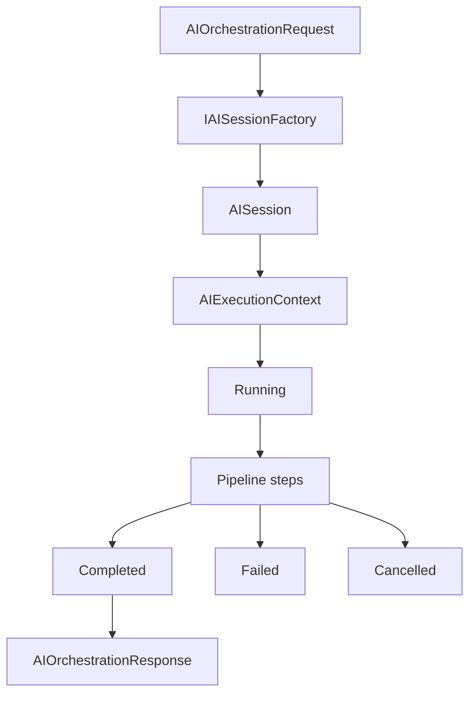

# AI Session And Execution Context

TradeMind uses AI session and execution context contracts to make AI orchestration observable, tenant-aware, and ready for future Memory and Cost Engine work without adding persistence in this increment.

## AISession

`AISession` is the logical identity of one AI interaction. It contains:

- `SessionId`
- optional `ConversationId`
- `CorrelationId`
- optional `TenantId`
- optional `UserId`
- optional `AgentId`
- `Scenario`
- `CreatedAtUtc`
- read-only metadata

`SessionId`, `CorrelationId`, and `Scenario` are required. Dates must be UTC. Identifiers stay as strings so external identity systems can be integrated later.

## AIIdentityContext

`AIIdentityContext` carries identity values into orchestration without depending on ASP.NET Core, `HttpContext`, `ClaimsPrincipal`, JWT, Zitadel, or another identity provider.

The API layer can later map authenticated request data into this contract. The AI Application layer only sees tenant, user, agent, and safe identity metadata values.

## AIExecutionContext

`AIExecutionContext` is the per-request working state used by the pipeline. It contains the session, orchestration request, optional `ChatRequest`, optional `ChatResponse`, optional final response, metrics, executed steps, current state, optional safe error, and controlled internal items.

The context is mutable during execution, but mutations are explicit. Callers use methods such as `Start`, `MarkStepStarted`, `MarkStepCompleted`, `SetChatRequest`, `SetChatResponse`, `SetFinalResponse`, `Complete`, `Fail`, and `Cancel`.

The context must not contain services and must not become a service locator.

## AIExecutionMetrics

`AIExecutionMetrics` records:

- `StartedAtUtc`
- optional `CompletedAtUtc`
- total duration
- optional provider duration
- optional prompt construction duration
- optional input, output, and total tokens
- optional provider name
- optional model name

Token counts cannot be negative. If input and output tokens are known, total tokens must equal their sum. Missing token values stay null.

## AIExecutionState

`AIExecutionState` has five values:

- `Created`
- `Running`
- `Completed`
- `Failed`
- `Cancelled`

Transitions are controlled by `AIExecutionContext`. Completed, failed, and cancelled executions are terminal.

## AIExecutionError

`AIExecutionError` stores safe failure information: code, non-sensitive message, optional step name, optional provider name, UTC occurrence date, optional transient flag, exception type, and safe metadata.

It does not store stack traces, API keys, prompts, provider responses, KnowledgeHub documents, certificates, or sensitive personal data.

## Lifecycle

## Identity Propagation

`AIOrchestrationRequest` can provide `SessionId`, `ConversationId`, `CorrelationId`, and `AIIdentityContext`. The session factory generates missing session and correlation identifiers and copies identity values to `AISession`.

Prompt construction adds safe operational identifiers such as session, correlation, scenario, conversation, tenant, user, and agent ids to provider request metadata. It does not add raw prompt content or secrets to logs.

## Orchestrator Integration

`IAIOrchestrator` creates an `AISession`, creates an `AIExecutionContext`, starts the context, executes ordered steps, completes the context on success, fails it on application errors, and cancels it on `OperationCanceledException`.

The orchestrator still raises exceptions for failed executions. Public responses are returned only for successful executions.

## Future Memory Engine

Memory Engine uses `SessionId`, `ConversationId`, `TenantId`, `UserId`, and `Scenario` to decide what context can be retrieved or stored. `AIOrchestrationRequest.UseMemory` enables the behavior per request. Memory-specific services are not stored in `AIExecutionContext`; optional memory messages and safe counts are carried through `Items` so the core context does not become a service locator.

The current Memory Engine implementation is in-memory only. It stores conversation entries and summaries for the life of the process and is not durable production storage.

## Future Cost Engine

Cost Engine can later consume provider, model, duration, and token metrics. This sprint does not store prices or calculate cost.

## Confidentiality

Session and execution metadata are operational contracts, not a place to store secrets or sensitive user content. Logs include identifiers, state, step names, provider, model, and durations. Logs do not include prompts, user messages, responses, secrets, documents, or unsafe metadata.
