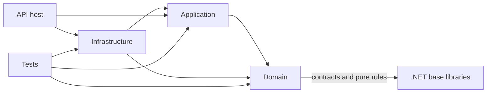

# Dependency Rules

TradeMind is a modular monolith. The repository is deployed as one application,
but module boundaries are enforced through project references, public contracts,
and review checks.

## Layer direction

The allowed direction is:

Domain projects do not reference Application, Infrastructure, API, EF Core,
Npgsql, pgvector, HTTP frameworks, broker SDKs, or concrete AI providers.
Application projects depend on domain contracts and ports. Infrastructure owns
adapters such as EF Core, PostgreSQL, pgvector, Docker-facing dependencies, and
provider SDKs. The API composes modules; it does not become a shared domain
layer.

## Module boundaries

Modules communicate through explicit contracts. A module must not query another
module's tables, reuse another module's EF Core DbContext, or reference an
infrastructure project to obtain an implementation. Cross-module dependencies
must point to a stable abstraction or application contract and be justified by
the owning module.

The current platform includes Market Connectors, KnowledgeHub, Context, Expert
Agents, Dispatcher, Consensus, Trading Decisions, Risk, Trading Plans, Trading
Workspace, Trading Assistant, Analytics, Coaching, and Paper Trading. Paper
Trading consumes workspace and plan results; it does not call a broker or a live
connector.

## Package rules

- Package versions are declared in `Directory.Packages.props`.
- Project files declare package identity only; they do not introduce ad hoc
  versions.
- Database packages belong in infrastructure or integration-test projects.
- Test infrastructure packages belong in test projects.
- Concrete AI SDKs remain outside domain and application contracts.
- Adding a package requires a reason, a license check, and a test impact note.

## Enforcement

The `scripts/validate-dependencies.ps1` check validates the highest-risk rules:
domain package isolation, domain-to-outer-layer references, and project naming.
It runs in CI and should also be run locally before opening a pull request.
The solution build, warnings-as-errors policy, and tests remain the final
verification of the dependency graph.
