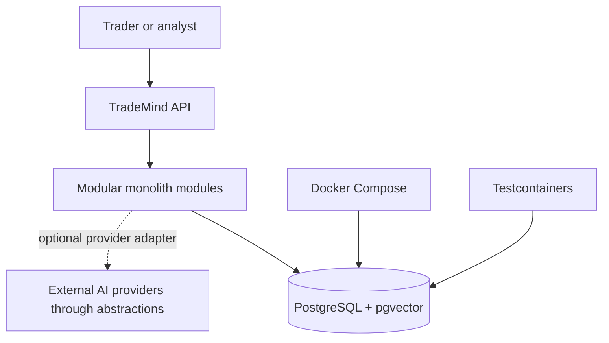
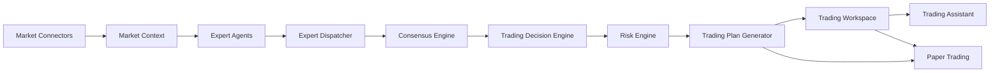
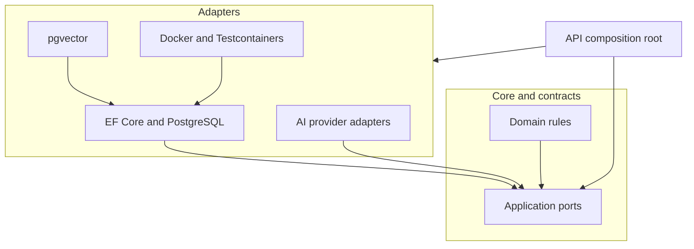
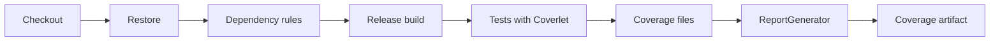

# Architecture Diagrams

The diagrams below describe the current runtime shape and the direction of
data through the platform. They are intentionally technology-aware at the
boundary and technology-neutral at the core.

## System context

## Module flow

## Clean Architecture boundary

## CI quality flow

