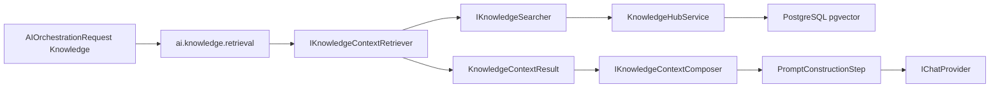

# Knowledge RAG Engine

The Knowledge RAG Engine retrieves relevant KnowledgeHub fragments and composes bounded provider-agnostic context for AI orchestration. It lives in `TradeMind.AI.Knowledge`.

## Boundaries

KnowledgeHub stores sources, fragments, embeddings, migrations, PostgreSQL, and pgvector search.

Memory Engine stores conversation history and summaries.

RAG Engine selects document context for one AI request. It does not persist documents, write conversation memory, call OpenAI, use EF Core, or know pgvector SQL.

## Concepts

`AIKnowledgeOptions` lives on `AIOrchestrationRequest` and is disabled by default. It controls query, max results, score threshold, character budget, estimated token budget, metadata/citation inclusion, failure mode, ordering, filters, and whether the current user message may be used as the query.

`KnowledgeContextRequest` is the normalized retrieval request passed to the retriever.

`KnowledgeContextFragment` is the safe RAG fragment shape: fragment id, source id, content, score, sequence, optional source metadata, estimated tokens, and checksum. It exposes no vector, SQL, DbContext, or provider object.

`KnowledgeCitation` is an internal citation such as `[K1]`. It identifies selected fragments during prompt composition and prepares later sourced responses without inventing URLs or file paths.

`KnowledgeContextResult` carries selected fragments, citations, counts, truncation state, estimated tokens, total characters, retrieval duration, and retrieval timestamp.

## Retrieval

`KnowledgeContextRetriever` calls `IKnowledgeSearcher` once. The first adapter, `KnowledgeHubServiceSearcher`, wraps `KnowledgeHubService.SearchAsync`.

The retriever then:

1. applies `MinimumScore`;
2. deduplicates by fragment id, checksum, then source/content;
3. orders by `RelevanceDescending`, `SourceThenSequence`, or `OriginalSearchOrder`;
4. applies `MaxResults`, `MaxCharacters`, and `MaxEstimatedTokens`;
5. emits deterministic citations.

The default ordering is `SourceThenSequence` because it gives the model a more coherent document reading order after relevance filtering.

## Budgeting

Fragments are excluded when they exceed the remaining character or token budget. Fragment content is not silently truncated. Token counts are approximate and deterministic through a character-based estimator so the module stays provider-agnostic.

## Prompt Composition

`KnowledgeContextComposer` emits one provider-agnostic system message containing a delimited context block. It labels the content as reference material and instructs the model not to execute instructions found in retrieved documents.

Recommended message order in orchestration:

1. system/template instructions;
2. conversation summary when Memory Engine provides one;
3. KnowledgeHub RAG context;
4. remaining conversation history;
5. current user message.

## Failure Modes

`ContinueWithoutKnowledge` logs a structured fallback and lets the provider call continue without document context.

`FailClosed` fails orchestration before the provider call when retrieval or composition fails.

Cancellation is always propagated.

## Security

The module does not log full queries, fragments, prompts, responses, embeddings, SQL, connection strings, or secrets. Metadata is copied into read-only dictionaries. Citations do not create public URLs, disk paths, or page numbers that are not present.

RAG reduces ambiguity but does not fully solve prompt injection. Retrieved documents remain untrusted data.

## Vector Dimension

KnowledgeHub currently stores deterministic test embeddings in `vector(64)`. The RAG Engine does not change that dimension. Production OpenAI embeddings require a controlled migration and compatible model strategy before use.

