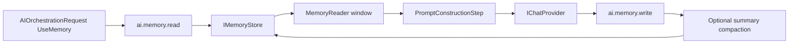

# Memory Engine

The Memory Engine manages provider-agnostic conversational memory for AI sessions. It lives in `TradeMind.AI.Memory` and is separate from KnowledgeHub, RAG, provider infrastructure, EF Core, PostgreSQL, pgvector, ASP.NET Core, and OpenAI SDK types.

## Concepts

`ConversationMemoryKey` identifies one memory scope with required `ConversationId` and optional `TenantId` and `UserId`. When tenant or user values are present, they are part of the key. There is no fallback between tenants or users.

`ConversationMemoryEntry` represents a single conversation message. It stores role, content, UTC creation time, monotonic sequence number, optional session and correlation identifiers, optional token count, sensitivity flag, and immutable metadata.

`ConversationMemory` is an immutable snapshot of a conversation: key, ordered entries, optional summary, creation/update timestamps, optional expiration, and logical revision.

`ConversationSummary` stores bounded older context and explicitly records `SummarizedThroughSequence` so readers can avoid duplicating covered entries in the prompt context.

## Context Window

`MemoryWindowOptions` controls how much memory can be injected:

- maximum entries;
- optional character limit;
- optional estimated token limit;
- system message inclusion;
- summary inclusion;
- minimum recent user and assistant messages.

`MemoryReader` prioritizes recent messages, preserves chronological order in the final result, can include the summary, and excludes entries already covered by the summary.

## Token Estimation

`ITokenEstimator` is intentionally lightweight. `CharacterBasedTokenEstimator` uses a deterministic character-count estimate and does not depend on OpenAI or another tokenizer. It is replaceable when provider-specific token accounting becomes necessary.

## Summary And Compaction

`IConversationSummarizer` can summarize a previous summary plus ordered entries. The sprint implementation, `DeterministicConversationSummarizer`, is local and deterministic. It is intended for tests and development, not production-quality language synthesis.

`MemoryWriter` can compact when `MemoryCompactionOptions.SummarizeAfterEntryCount` is reached. It summarizes older entries, keeps recent entries available, saves the summary, and does not delete original entries in the in-memory store.

## Concurrency

`InMemoryMemoryStore` uses locks scoped by `ConversationMemoryKey`. Concurrent writes to the same conversation receive monotonic sequence numbers without overwriting entries. Different conversations do not share one global lock.

## Expiration

`MemoryRetentionOptions` supports optional TTL, sliding expiration, and opportunistic removal on access. The implementation uses `TimeProvider`; there is no background worker in this sprint.

## Orchestrator Integration

Memory integration is optional. `AddTradeMindAIOrchestration()` continues to register the core AI pipeline. `AddTradeMindMemory()` registers memory contracts and two optional pipeline steps:

- `ai.memory.read`, before prompt construction;
- `ai.memory.write`, after provider success and before response normalization.

`AIOrchestrationRequest.UseMemory` enables memory for a request. A conversation id is required when memory is enabled. The read step converts selected memory into provider-agnostic `ChatMessage` values and stores them in `AIExecutionContext.Items`. `PromptConstructionStep` inserts them before the current user message for both the legacy prompt path and the Prompt Engine path.

Final message order is:

1. system/template messages;
2. optional conversation summary;
3. selected memory entries in chronological order;
4. current user message;
5. provider response is written after success, not sent back into the same provider call.

## Security

Logs include identifiers, counts, sequence ranges, state, and durations. Logs do not include user content, assistant content, summaries, prompts, provider responses, secrets, or sensitive metadata values.

The in-memory implementation is not durable, is not multi-pod safe, and should not be used as production storage. Future persistence should implement `IMemoryStore` with PostgreSQL while preserving tenant and user isolation.

## Difference From KnowledgeHub And RAG

Memory Engine stores conversation history and summaries. KnowledgeHub stores user knowledge sources and fragments. RAG retrieves relevant external or user-provided knowledge. This sprint does not add embeddings, pgvector, semantic search, or document retrieval to memory.

