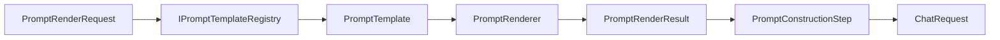

# Prompt Engine

The Prompt Engine is the provider-agnostic layer for defining, versioning, validating, and rendering prompt templates. It lives in `TradeMind.AI.Application`.

## Concepts

`PromptTemplate` is a named, versioned prompt definition for a logical scenario.

`PromptMessageTemplate` is one ordered message with a provider-independent role and a content template.

`PromptVariableDefinition` defines an input variable, its type, whether it is required, optional default value, sensitivity, and optional max length.

`PromptRenderRequest` asks the engine to render a template version with supplied variables.

`PromptRenderResult` contains rendered provider-independent messages, template id, version, scenario, safe variables used, sensitive variable names, render time, and correlation id.

## Syntax

Variables use double braces:

```text
{{variableName}}
```

Variable names must start with a letter and then use letters, numbers, or underscores. The renderer does not execute code and does not resolve nested object paths.

## Versioning

`PromptTemplateVersion` uses `major.minor`, for example:

- `1.0`
- `1.1`
- `2.0`

The registry can select an explicit version or the latest active version.

## Variables

Supported types:

- `String`
- `Integer`
- `Decimal`
- `Boolean`
- `DateTime`
- `Json`

Unknown variables are rejected. Required variables must be present unless a compatible default exists. Values that exceed `MaxLength` are rejected. Missing optional variables without defaults can omit messages that render empty.

Sensitive variables can be used for rendering but their values are not logged and are not returned in `VariablesUsed`.

## Registry

`IPromptTemplateRegistry` exposes explicit and latest-version lookup.

`InMemoryPromptTemplateRegistry` stores immutable templates registered through DI. It supports multiple templates and versions, rejects duplicate versions, and fails explicitly for unknown templates or versions.

No database, file access, or external system is used in this increment.

## Renderer

`IPromptRenderer` renders templates through `PromptRenderer`.

The renderer:

- resolves the template;
- validates declared variables;
- applies defaults;
- converts values using deterministic culture behavior;
- replaces all occurrences;
- rejects unresolved placeholders;
- preserves message order;
- emits provider-independent rendered messages;
- respects `CancellationToken`.

## Orchestrator Integration

`AIOrchestrationRequest` can provide `PromptTemplateId`, optional `PromptTemplateVersion`, and prompt variables.

If a template id is supplied, `PromptConstructionStep` renders the template and adapts the rendered messages to `ChatRequest`. If no template id is supplied, the historical `SystemInstruction` plus `UserMessage` path remains in place.

When Memory Engine is registered and enabled for the request, memory messages are inserted after rendered system/template context and before the current user message. Prompt templates remain provider-agnostic and do not depend on memory storage contracts.

When Knowledge RAG Engine is registered and enabled for the request, a delimited KnowledgeHub context message is also inserted before the current user message. Prompt templates do not call KnowledgeHub directly.

## Generic Chat

The built-in template is:

- id: `generic-chat`
- version: `1.0`
- scenario: `GenericChat`

Messages:

```text
System: {{systemInstruction}}
User: {{userMessage}}
```

Variables:

- `systemInstruction`: optional string with a safe default.
- `userMessage`: required string.

## Security

The engine does not log rendered prompts, variable values, full user content, secrets, or provider responses. Exceptions contain template id, version, correlation id, and safe variable names only.

Prompt injection defense is outside this sprint and should be handled by future policy and product-specific layers.

## Future Work

Future increments can add persistent template storage, authoring workflows, approval states, business templates, prompt injection policy, evaluation results, and telemetry. Those additions should preserve provider independence.


