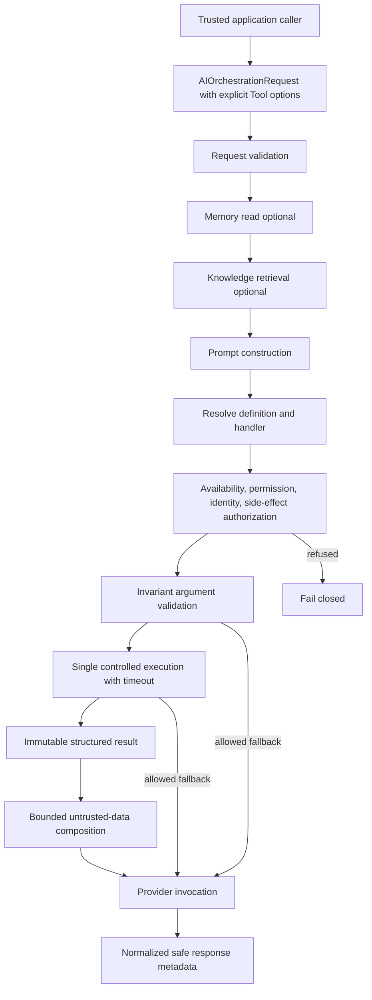

# Tool Engine

The TradeMind Tool Engine executes explicitly requested application capabilities behind a provider-agnostic security boundary. It does not let a model select or call tools from untrusted text.

## Module boundary

The core lives in `src/TradeMind.AI.Tools`. It depends on AI abstractions and lightweight dependency injection, logging, and options packages. It has no dependency on OpenAI, provider infrastructure, EF Core, Npgsql, ASP.NET Core, `HttpContext`, filesystem, database, network, KnowledgeHub Infrastructure, or a concrete Memory Store.

`TradeMind.AI.Application` provides the optional orchestration adapter because it owns `AIExecutionContext` and pipeline steps. Provider contracts remain unchanged: `ChatRequest` and `ChatResponse` do not publish or receive native tool calls.

## Definitions and parameters

`AIToolDefinition` is immutable public metadata. It contains:

- case-sensitive lowercase-kebab-case `AIToolId`;
- display name, description, and version;
- immutable parameter definitions;
- required permissions and optional identity or scenario restrictions;
- side-effect level and idempotence declaration;
- optional default timeout;
- enabled, disabled, or development-only availability;
- read-only tags and filtered metadata.

Parameters support String, Integer, Decimal, Boolean, DateTime, and Json. Each parameter declares its name, requirement, description, optional default, optional length or numeric bounds, optional allowed values, sensitivity, nullability, and optional simple JSON schema.

## Registry and discovery

`InMemoryAIToolRegistry` receives all `IAITool` instances through constructor injection and creates an immutable id map. Duplicate ids fail during container construction. The registry does not resolve services or execute handlers.

`GetAvailableAsync` returns definitions only. Discovery filters permissions, tenant, user, agent, scenario, tags, runtime availability, and maximum side-effect policy. Disabled tools never appear. Development-only tools appear only when `AIToolEngineOptions.EnableDevelopmentTools` is true.

## Authorization

`PermissionBasedAIToolAuthorizer` consumes `AIToolAuthorizationContext`; it does not consume web identity objects. It enforces:

- availability;
- every required permission;
- the lower of global and request-specific side-effect ceilings;
- optional tenant, user, agent, and scenario allowlists.

The global default permits `None` and `ReadOnly`. Higher levels require explicit global configuration and an explicit request allowance. Unknown, disabled, development-disabled, and unauthorized tools cannot execute.

## Validation

The public execution request carries a read-only dictionary of JSON values. `AIToolArgumentValidator` rejects unknown arguments by default, applies defaults, converts with `CultureInfo.InvariantCulture`, checks constraints, and returns immutable typed `AIToolArguments`.

Tools access values through typed methods such as `GetRequiredString`, `GetRequiredInteger`, `GetRequiredDecimal`, `GetRequiredBoolean`, `GetRequiredDateTime`, and `GetRequiredJson`. No reflection or uncontrolled dynamic conversion is used.

Sensitive values never appear in errors or logs. For sensitive parameters, validation also omits the parameter name from safe public error detail where disclosure would be inappropriate.

## Execution

`AIToolExecutor` uses this fixed pipeline:

1. Resolve exactly one tool.
2. Authorize its definition.
3. Validate and normalize arguments.
4. Resolve and cap the timeout.
5. Build a controlled `AIToolExecutionContext`.
6. Invoke `IAITool.ExecuteAsync` once.
7. Measure with `TimeProvider`.
8. Normalize the immutable result.
9. Log safe metadata only.

There is no automatic retry. `AIToolExecutionContext` exposes no `IServiceProvider`, logger, database context, HTTP context, SDK client, or arbitrary mutable service. Tool dependencies belong in constructor injection.

## Timeouts and cancellation

Timeout selection uses request override, tool default, then global default. `MaximumTimeout` caps the effective duration. A `TimeProvider`-backed cancellation source is linked to the caller token.

Caller cancellation propagates unchanged as `OperationCanceledException`. An internal timeout produces `AIToolTimeoutException` with stable code `AI_TOOL_TIMEOUT`, safe timestamps, duration, and a timed-out metric. Handlers must observe the token; the engine does not abandon a deliberately uncooperative task.

## Idempotence and effects

Definitions declare idempotence and one side-effect level: `None`, `ReadOnly`, `ReversibleWrite`, `IrreversibleWrite`, or `ExternalAction`. The engine validates and transports `IdempotencyKey`, but does not persist it or claim cross-process deduplication or exactly-once execution.

The built-in tools are:

- `echo`: development-only, deterministic, returns bounded text as JSON;
- `add-numbers`: enabled, deterministic, returns the decimal sum as JSON.

Both are idempotent and `None`. They perform no I/O, trading, market lookup, broker call, file access, network call, or database operation.

## Results and errors

`AIToolExecutionResult` contains the tool id, success, structured immutable output, output kind, content type, UTC timestamps, duration, safe optional error, filtered public metadata, optional retry indication, and idempotency key.

Stable exception classes distinguish not found, unavailable, authorization, validation, execution, and timeout. Raw exceptions and stack traces do not cross into the normalized orchestration response. Full arguments and output are not exposed by `AIOrchestrationResponse`.

## Orchestrator integration

Registration is explicit:

```csharp
services.AddTradeMindAIOrchestration();
services.AddTradeMindAIToolOrchestration(options =>
{
    options.EnableDevelopmentTools = environmentPolicy.EnableDevelopmentTools;
});
```

`AIOrchestrationRequest.Tool` is disabled by default. When enabled, the caller must provide an `AIToolId`, structured arguments, permissions, side-effect ceiling, optional timeout override, optional idempotency key, and failure mode.

If tool invocation is enabled but the Tool Engine orchestration steps are absent, the orchestrator fails closed before provider invocation. A missing module registration cannot silently downgrade the request to ordinary chat.

`ToolExecutionStep` runs after prompt construction. `ToolResultCompositionStep` inserts a successful result before the current user message, clearly labels it as untrusted external data, bounds its size, and tells the model not to execute instructions found inside it. It uses a provider-agnostic system wrapper and does not pretend that native provider tool calling occurred.

`FailClosed` prevents provider invocation after validation or execution failure. `ContinueWithoutTool` can continue after non-security failures without composing a result. Authorization, unavailable, and unknown-tool failures always remain closed.

The response exposes only `ToolUsed`, `ToolId`, `ToolSuccess`, `ToolDuration`, and `ToolErrorCode`.

## Memory, Knowledge, and Prompt Engine

Prompt construction happens before explicit tool execution. Existing Memory and Knowledge steps prepare their context first. The successful tool result is then inserted after that prepared context and before the current user message.

Tool output is not written into Memory Engine automatically. Knowledge RAG does not index or retrieve tool output. Prompt Engine templates do not declare executable tools. These boundaries prevent accidental retention and keep each module responsible for its own policy.

## Flow



## Future provider-native tool calling

A later increment may adapt provider definitions and tool-call requests to this engine. It must add explicit policy for tool call ids, multiple calls, loop limits, streaming, model-proposed arguments, confirmation for effects, and provider capability checks. The core registry, authorization, validation, execution, timeout, result, and observability rules remain the enforcement boundary.

## Limits

- The registry is in-memory and fixed after dependency injection composition.
- Timeout enforcement is cooperative.
- Idempotency has no durable store.
- Only one explicit tool invocation is supported per orchestration request.
- No native OpenAI tool calling, autonomous loop, multi-tool execution, retry, broker, market data, portfolio, trading order, HTTP API, UI, or database persistence is included.
