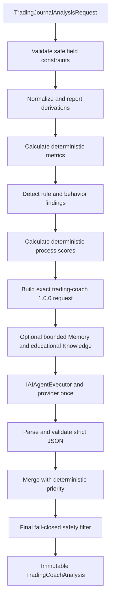

# Trading Coach

## Purpose

`TradeMind.Trading.Coaching` implements the first functional TradeMind business agent: `trading-coach` `1.0.0`. It reviews trading journal information supplied explicitly by an application caller and produces structured educational coaching about process quality.

The module focuses on plan adherence, discipline, documented risk, position-size coherence, entry and exit rationale, behavioral mistakes, journal quality, and concrete review actions. It does not fetch market data, predict prices, select assets, recommend leverage or lot size, place orders, access a broker, guarantee outcomes, or replace professional financial advice.

## Boundary

The module references `TradeMind.AI.Agents` and `TradeMind.AI.Application`. Its remaining dependencies are Microsoft DI, Options, and Logging abstractions. It has no EF Core, Npgsql, pgvector, OpenAI SDK, ASP.NET Core, ambient HTTP identity, filesystem, broker, or market-data dependency.

The current input is a snapshot contract, not a persisted Trading Journal aggregate. A future Trading Journal module can map its own authorized read model into `TradingJournalAnalysisRequest` without giving the coach direct database access.

## Input

`TradingJournalAnalysisRequest` contains optional identifiers, instrument and market labels, direction, entry and exit values, stop and target, position and account values, planned and actual risk, result, setup and timeframe, planning and execution notes, emotional notes, rules, mistakes, lessons, tags, and UTC timestamps.

Optional fields let the coach report missing information rather than invent it. Constructors copy every collection, and public results expose read-only collections.

`TradingCoachProfile` controls language, experience level, style, personal risk and loss limits, known rules, focus areas, tone, and detail. These preferences personalize education; they cannot relax safety policy.

## Validation and normalization

`ITradingJournalValidator` checks numeric signs and ranges, percentage consistency, UTC dates, date order, supported directions, configurable R bounds, and text length. Validation errors report field names without values.

`ITradingJournalNormalizer` trims text, maps direction to `long` or `short`, canonicalizes common timeframe forms, lowercases and deduplicates tags, and preserves explicit numeric values. It derives actual risk percentage from risk and balance, or realized R from result and risk, only when the explicit field is absent. The result lists derivations, warnings, and a deterministic completeness score.

## Metrics

`ITradeMetricsCalculator` calculates only values supported by supplied facts:

- Actual risk percentage.
- Planned reward-to-risk.
- Realized R multiple.
- Duration in minutes.
- Entry-to-stop and entry-to-target distance.
- Result as a percentage of balance.
- Actual-minus-planned risk delta.

The result identifies each calculation source and unavailable metric. Explicit contradictory R is preserved and warned about. No calculation predicts a price, future success, expectancy without history, or a recommended position size.

## Rules and behavior

`ITradingCoachRuleAnalyzer` gives code-based findings priority over model interpretation. It detects missing process documentation, risk-limit breaches, reported rule breaches, strong emotional language, inconsistent R, and process-versus-result distinctions.

`ITradingBehaviorPatternDetector` uses transparent English and French lexical patterns for FOMO, revenge trading, overtrading, hesitation, impulsive entry, moved stop, early exit, ignored plan, and oversized position. It uses no external model. Negation, quotation, indirect wording, and language variation can create false positives or negatives, so every match is a review cue rather than a conclusion.

## Scoring

`TradingCoachScores` contains six bounded 0-100 scores. `TradingCoachScoreExplanation` lists factors, confidence, and whether the score is rule-based. The deterministic scorer applies explicit penalties from code findings, uses normalized completeness for journal quality, and computes overall process quality from process dimensions. Profit and loss do not directly change scores.

The provider may propose scores for narrative context, but the merger replaces them with deterministic scores. Scores describe review quality only and are not profitability forecasts.

## Prompt and JSON output

`trading-coach-analysis` `1.0` receives declared JSON variables for normalized journal data, computed metrics, rule findings, coaching profile, required schema, and safety rules, plus requested language. Data is enclosed in named delimiters and explicitly treated as untrusted.

The provider returns strict JSON containing summary, data quality, strengths, findings, risk, execution and psychology observations, missing information, priorities, linked actions, checklist, scores, and disclaimer. The parser rejects unknown, duplicated, malformed, missing, or out-of-range content. Code assigns `AnalysisId`, `GeneratedAtUtc`, and agent version.

## Merge and final safety

`ITradingCoachAnalysisMerger` preserves deterministic metrics, scores, violations, and missing fields. AI can add a linked recommendation or explanation but cannot remove or rewrite a deterministic fact. Recommendation and checklist counts are bounded by `TradingCoachExecutionOptions`.

`ITradingCoachSafetyFilter` scans every user-facing text surface after merging. It fails closed by default on directional instructions, order language, maximum-leverage instructions, exact price predictions, guarantees, and return promises in common English and French forms. Pattern matching is defense in depth and cannot guarantee detection of every unsafe formulation.

## Memory, Knowledge, and Tools

Memory is optional, bounded, and configured to continue without memory on failure. Automatic storage of both the raw user message and provider response is disabled. A host may use existing memory only for nonsensitive coaching preferences, goals, rules, or improvement themes.

Knowledge is optional and bounded to educational process material. The allowed filter vocabulary is `contentPurpose`, `topic`, and `language`; the host's retrieval adapter is responsible for enforcing any backing-store semantics. RAG must not supply signals, predictions, asset selections, or regulated advice.

Tools are disabled. All arithmetic is implemented by internal deterministic calculators. The agent cannot call `echo`, `add-numbers`, market, broker, price, or order tools and has a side-effect ceiling of `None`.

## Execution flow

Validation, parsing, safety, authorization, and timeout failures stop the analysis. Optional Memory or Knowledge can continue in reduced mode. Caller cancellation remains distinct from timeout.

## Limits

The MVP analyzes one supplied snapshot. It does not persist journals, compare a history of trades, diagnose psychology, validate strategy edge, inspect live prices, calculate recommended lots, or execute any action. Cross-trade repetition analysis requires a future authorized history contract and retention decision.
