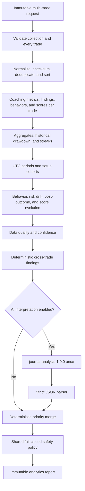

# Trading Journal Analytics

## Purpose and boundary

`TradeMind.Trading.Analytics` produces descriptive, educational process analytics from a journal history supplied explicitly by an application caller. It complements the single-trade `TradeMind.Trading.Coaching` module; it does not own journal persistence and cannot access market data, a broker, orders, HTTP context, EF Core, PostgreSQL, pgvector, or a concrete AI SDK.

The module reviews discipline, documented risk, plan adherence, journal quality, setup consistency, repeated behavior, post-outcome associations, historical streaks, historical R drawdown, and deterministic coaching-score evolution. It does not predict performance, validate strategy edge, recommend an asset, lot, leverage, or order, or establish psychological or financial causality.

## Input and options

`TradingJournalAnalyticsRequest` copies its trade collection and contains a `TradingCoachProfile`, optional UTC date range, grouping period, request trend threshold, analysis switches, language, and safe correlation, session, tenant, and user identifiers. It contains no cancellation token. Cancellation is supplied only to `ITradingJournalAnalyticsService.AnalyzeAsync`.

`TradingJournalAnalyticsOptions` bounds trades, groups, setups, behavior patterns, recommendations, checklist items, timeout, minimum samples, completeness, invalid-trade behavior, and optional AI, Memory, and Knowledge use. AI, Memory, and Knowledge are disabled by default. Invalid trades fail closed and are excluded by default.

## Validation

`ITradingJournalAnalyticsValidator` validates collection size and request policy, then invokes `ITradingJournalValidator` for every trade. Errors use indexed safe field names such as `Trades[3].EntryPrice` and never include values. It distinguishes invalid and incomplete records, applies the requested UTC date window, calculates global completeness, and returns the effective date range.

If fail-on-invalid is disabled, invalid records can either be excluded or retained according to `ExcludeInvalidTradesFromAggregates`. Retaining them does not make their fields valid; the data-quality result continues to report them.

## Normalization and deduplication

`ITradingJournalCollectionNormalizer` invokes the existing single-trade normalizer, records derived-field counts, and applies this deterministic policy:

1. A normalized `JournalEntryId` is the primary duplicate key.
2. Without an id, a SHA-256 checksum is calculated over canonical normalized fields using invariant numeric and UTC date representations.
3. Exact duplicates count once.
4. Conflicting records with one id are reported and never field-merged.
5. The record with greater completeness is retained; equal completeness retains the earliest supplied occurrence.
6. Output is ordered by opened date, then closed date fallback, then original input index.

This policy avoids silently synthesizing a trade that the caller did not provide.

## Deterministic statistics

`ITradingStatisticsCalculator` implements mean, median, minimum, maximum, sum, rates, average duration, aggregate metrics, historical R drawdown, streaks, and score evolution with invariant arithmetic. A missing value is excluded from only the calculation requiring that value. Empty inputs return null for unavailable optional values and zero for rates or sums where a denominator or value set is absent.

`TradingJournalAggregateMetrics` reports observed counts, risk, result R, duration, plan adherence, stop use, completeness, and process-versus-outcome counts. Every value is descriptive.

## Historical drawdown and streaks

`HistoricalRDrawdown` walks the chronological supplied R sequence, tracks cumulative R peaks and troughs, and identifies the largest observed decline and optional recovery index. Missing R contributes no change. The metric is order-dependent historical description, not an estimate of future drawdown.

`TradingStreakMetrics` reports longest and current win/loss streaks plus consecutive rule violations, oversized trades, and incomplete journals. Oversizing uses explicit behavior evidence or the supplied profile maximum.

## Time grouping

Grouping supports `None`, `Day`, `Week`, and `Month`. All boundaries use UTC and an exclusive period end. A week starts Monday at `00:00:00Z`, independent of process culture. Groups are chronological; when `MaximumGroups` is exceeded, the most recent bounded groups are retained. Each group includes aggregate metrics, average deterministic scores, behavior counts, completeness, and a sample-sufficiency flag.

Trades without a timestamp contribute to overall aggregates but cannot enter a calendar group. Data quality reports that limitation.

## Setup cohorts

Setup names are collapsed for whitespace and grouped case-insensitively. Each `TradingSetupAnalytics` reports observed R values, plan adherence, rule violations, risk, process score, common documented mistakes, and completeness. Insufficient cohorts carry an explicit warning and are never labeled profitable or unprofitable.

## Behavior trends

`ITradingBehaviorTrendAnalyzer` uses the existing deterministic lexical detector for FOMO, revenge trading, overtrading, hesitation, impulsive entry, moved stop, early exit, ignored plan, and oversized position. It reports affected source indexes and first and last UTC observations. Direction compares occurrence rates in the first and recent halves and is `Improving`, `Stable`, `Worsening`, or `InsufficientData`. Confidence is bounded by sample size and observed coverage; it is not a probability of truth.

## Risk drift

`IRiskDriftAnalyzer` compares baseline and recent documented risk and records observed associations after a loss, two losses, or a large win. It also detects repeated profile-limit exceedance and large between-trade variation. Supporting indexes remain tied to original input positions. Classification is deterministic and never says that an outcome caused later risk.

## Post-outcome associations

`IPostOutcomeBehaviorAnalyzer` describes the next supplied trade after a win, loss, two losses, large win, or rule violation. It may report next-risk change, next-violation rate, next-journal completeness, elapsed time, and following behavior counts. Every narrative explicitly uses "observed association" or the requested French equivalent and states that causality is not established.

## Score evolution and data quality

The six score series come from the existing deterministic Coaching engine: plan adherence, risk discipline, execution quality, emotional control, journal completeness, and overall process quality. Evolution compares first and recent halves, reports period values, and requires the configured sample size.

`TradingJournalDataQuality` combines completeness, valid/invalid/incomplete counts, missing-field frequency, duplicates, date coverage, and consistency into `Low`, `Moderate`, or `High` confidence. Confidence describes evidence quality, not future success.

## Rule analysis

`ITradingJournalRuleAnalyzer` evaluates aggregate risk, repeated limit breaches, discipline and violation direction, journal weakness, losing streaks accompanied by higher risk, process-versus-outcome distinctions, setup documentation, recurring behavior, and observable score progress. Findings, strengths, recommendations, and checklist items are deterministic. Each recommendation references at least one finding code.

## Agent and prompt

`journal-analysis` `1.0.0` is a provider-agnostic structured-output agent. It permits optional bounded Memory and educational Knowledge. Tools, streaming, provider-native tool calling, autonomous execution, market access, broker access, signals, and side effects are disabled.

The Prompt Engine uses `major.minor`, so template `trading-journal-analysis` `1.0` maps to agent `1.0.0`. The prompt receives aggregate metrics, data quality, behavior trends, risk drift, score evolution, setup analytics, rule findings, profile, language, schema, and safety rules. It receives no raw journal history and treats every supplied JSON block as untrusted data.

`ITradingJournalAIInterpreter` builds one exact agent request and calls `IAIAgentExecutor` once. There is no automatic retry. Memory never automatically stores the request or response; a host may use only preferences, goals, prior progress themes, and review frequency. Knowledge is restricted to educational discipline, journaling, psychology, and risk material.

## Parser, merger, and safety

The response parser accepts one JSON object, disallows comments, trailing commas, duplicate properties, and unknown fields, enforces collection limits and requested language, and never includes raw provider output in an exception. It rejects signals, predictions, promises, asset or order recommendations, leverage instructions, and financial certainty.

The merger treats deterministic report fields as immutable authority. AI may enrich only summary, explanations, linked recommendations, and checklist items. It deduplicates and bounds text in deterministic order. The final safety filter reuses `TradingCoachSafetyPolicy` and fails closed by default on critical content.

## Execution flow

Logs contain phases, identifiers, counts, durations, AI-use state, and safe error codes. They exclude notes, emotions, prices, balances, position sizes, P&L, raw journals, prompts, and provider responses.

## Limits

The engine analyzes an explicitly supplied snapshot and does not establish source authenticity, authorization, retention, or persistence. Lexical behavior detection is imperfect. First-versus-recent classification is not a significance test. Missing or incorrect dates affect grouping and order-dependent metrics. Setup and post-outcome comparisons are not strategy validation, causal inference, backtesting, portfolio analysis, or a prediction of future results.
