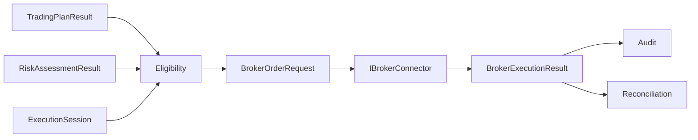

# Broker Abstraction

Sprint 28 introduit une frontière neutre entre les résultats analytiques TradeMind et les opérations d’exécution. Le domaine broker ne référence ni SDK de courtier, ni ASP.NET Core, ni EF Core. Les adaptateurs futurs traduiront leurs objets propriétaires vers les contrats `TradeMind.Brokers.Domain`.

Le flux accepté est `TradingPlanResult + RiskAssessmentResult + ExecutionSession` vers une validation d’éligibilité, un `BrokerOrderRequest`, un `IBrokerConnector`, puis un résultat normalisé, un audit et une réconciliation. La seule implémentation fournie est `InMemoryBrokerConnector`, en mode `Simulation`.

Les modes `Demo` et `Live` sont des contrats seulement. Le mode Live est désactivé par configuration et aucun connecteur réel n’est livré.
