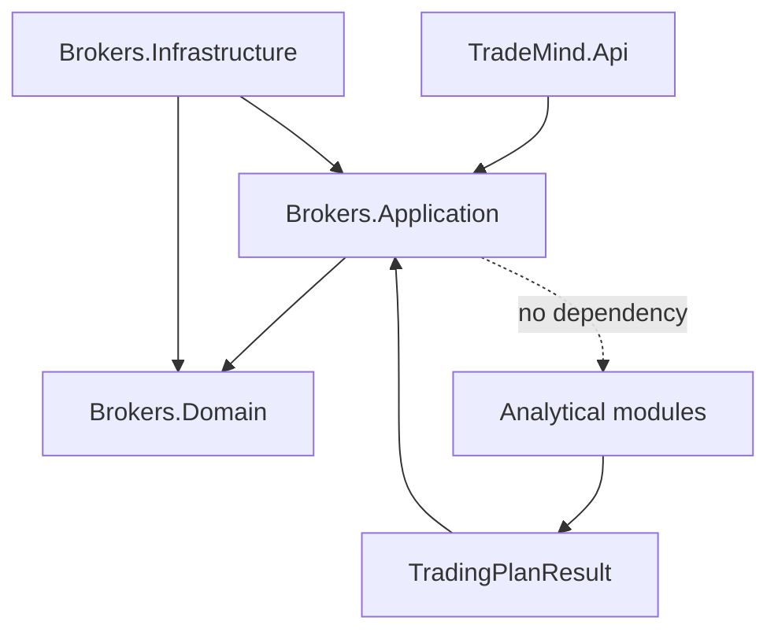

# Architecture

`TradeMind.Brokers.Domain` contient les identifiants, types d’ordres, capacités, comptes, instruments, ordres, positions, exécutions et erreurs. Il ne dépend que du BCL.

`TradeMind.Brokers.Application` contient les ports, le registre déterministe, les politiques d’autorisation et d’éligibilité, l’idempotence locale et le service d’exécution. Il consomme les contrats de plan et de risque, jamais des entités de persistence.

`TradeMind.Brokers.Infrastructure` contient le connecteur simulation, EF Core/Npgsql, la migration, l’idempotence durable, l’audit et la réconciliation. `TradeMind.Api` ne manipule que des DTOs API.

Les dépendances sont contrôlées par `scripts/validate-dependencies.ps1`.
