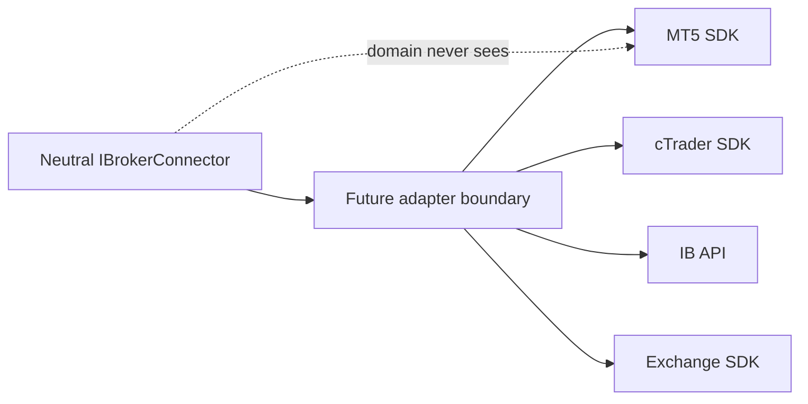

# Future Adapters

Un futur adaptateur MT5, cTrader, Interactive Brokers ou exchange devra référencer uniquement `TradeMind.Brokers.Application` et `TradeMind.Brokers.Domain`, convertir ses réponses vers les types neutres et garder son SDK dans son propre projet infrastructurel.

Ces adaptateurs devront ajouter leurs propres tests contractuels, erreurs mappées, health checks, secrets et vérifications de réconciliation avant toute activation.
