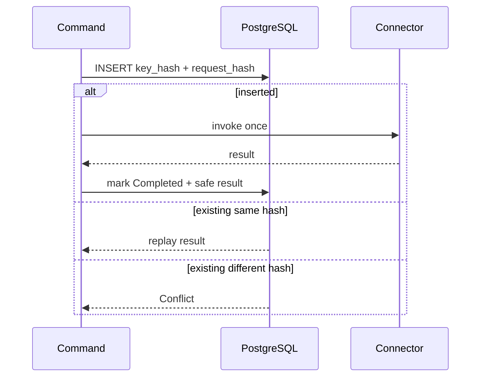

# Idempotency

La clé stockée est un hash de tenant, connecteur, compte, opération et clé client. Le hash de requête couvre les champs normalisés de l’ordre. Une même clé avec le même hash rejoue le résultat ; une même clé avec un hash différent renvoie `Conflict`.

En production configurée, `PostgreSqlBrokerIdempotencyStore` coordonne les instances par clé primaire PostgreSQL. La violation de contrainte unique est traitée explicitement. Le mode in-memory est destiné aux tests et au développement local.

