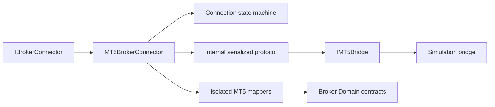

# MetaTrader 5 Adapter

Sprint 29 adds `TradeMind.Brokers.MetaTrader5` as the first provider adapter.
The public integration point is the existing `IBrokerConnector`; no MT5 type
is added to the analytical, broker domain, broker application, or API layers.

## Boundary

The adapter owns configuration, connection lifecycle, bridge transport,
serialization, protocol commands, mapping, retries, health, and telemetry.
The current bridge is deterministic and local. It models simulation/demo broker
acknowledgements and order state; it does not open sockets or invoke an MT5 SDK.

## State and safety

Connections move through `Disconnected`, `Connecting`, `Authenticating`,
`Connected`, `Reconnecting`, `Faulted`, and `Closed`. The state is explicit;
there is no boolean connection flag. A timeout faults the connection, while
external cancellation is propagated without being converted into a retry.

`Live` mode and `AllowLive=true` fail validation. `Demo` requires explicit
`AllowDemo=true`. The descriptor never advertises live capability, and the
simulation bridge never stores credentials or logs account secrets.

## Health and telemetry

Health retains bridge, protocol and terminal versions, latency, heartbeat,
reconnect count, state, and heartbeat/reconnect timestamps inside the adapter.
Activities are named `TradeMind.MT5.Connect`, `Disconnect`, `Send`, `Receive`,
`SubmitOrder`, `CancelOrder`, `ModifyOrder`, and `ClosePosition`; metrics use
only bounded connector, mode, operation, and outcome dimensions.
