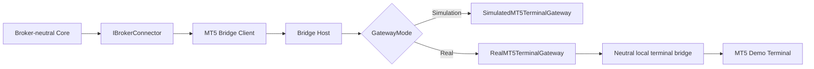
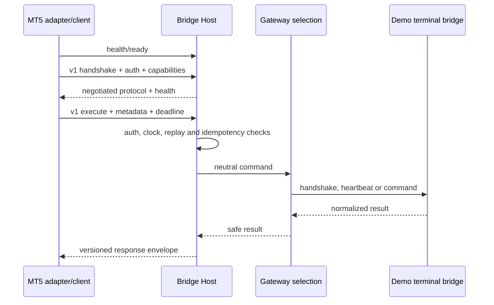

# External MT5 Bridge

Sprint 30 established a versioned HTTP/JSON boundary between the provider-neutral TradeMind broker connector and a MetaTrader 5 bridge host. Sprint 31 adds the first real terminal gateway behind that boundary without changing the broker-neutral analytical modules. The bridge host selects a deterministic simulation or a real local terminal-side bridge from configuration. The default is simulation.

The contracts remain immutable and neutral. The HTTP/JSON transport is intentionally inspectable and versioned; a future transport can preserve the same contracts without changing the analytical core.

The terminal-side bridge is a deployment component, not a core dependency. No native MT5 SDK is referenced by the solution. The current implementation therefore provides a real gateway boundary and transport contract, while the terminal-side implementation remains an explicitly configured integration responsibility.

## Request flow

## Host endpoints

| Endpoint | Purpose |
| --- | --- |
| `GET /health/live` | process liveness |
| `GET /health/ready` | host and gateway readiness |
| `GET /health/startup` | startup lifecycle status |
| `POST /bridge/v1/handshake` | protocol, capability and demo negotiation |
| `POST /bridge/v1/health` | version, terminal, heartbeat and latency snapshot |
| `POST /bridge/v1/execute` | bounded neutral command execution |

## Safety boundary

Both sides enforce demo-only mode. `AllowLive`, a live environment, a live account or a `mode=Live` payload is rejected. Submit, modify, cancel and close operations are never retried automatically after an uncertain transport outcome. There is no live broker connector, native MT5 SDK or production terminal implementation in this sprint.

## Related documents

- [Architecture](architecture.md)
- [Protocol](protocol.md)
- [Security](security.md)
- [Handshake](handshake.md)
- [Idempotency and replay](idempotency.md)
- [Health](health.md)
- [Demo mode](demo-mode.md)
- [Deployment](deployment.md)
- [Limitations](limitations.md)
- [ADR-0021](../../adr/ADR-0021-external-mt5-bridge-boundary.md)
- [Sprint 31 configuration](configuration.md)
- [Terminal discovery](terminal-discovery.md)
- [Execution safety](execution-safety.md)
