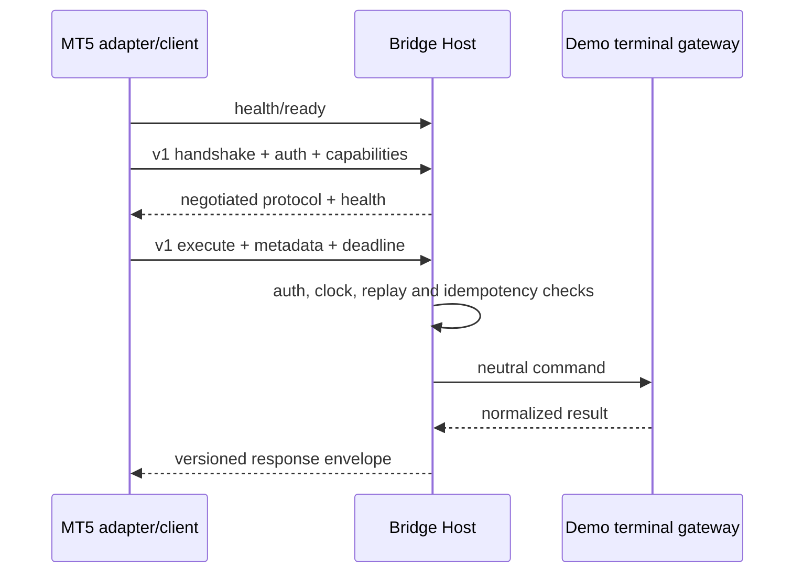

# External MT5 Bridge

Sprint 30 adds a versioned boundary between the provider-neutral TradeMind
broker connector and a MetaTrader 5 bridge host. The boundary is implemented
with HTTP/JSON because it is easy to inspect, version, secure and replay in
tests. A future transport can preserve the same contracts without changing
the analytical core.

## Scope

The solution contains three assemblies:

- `TradeMind.Brokers.MetaTrader5.Bridge.Contracts` contains immutable neutral
  protocol records and bounded error/capability values.
- `TradeMind.Brokers.MetaTrader5.Bridge.Client` implements the adapter-side
  client and the existing `IMT5Bridge` contract.
- `TradeMind.Brokers.MetaTrader5.Bridge.Host` exposes the versioned endpoints
  and a deterministic simulated terminal gateway.

The core knows only the existing `IBrokerConnector`. No MT5 SDK, native type,
database, EF Core model, HTTP client or bridge DTO is referenced by analytical
modules.

## Request flow

## Endpoints

| Endpoint | Purpose |
| --- | --- |
| `GET /health/live` | Process liveness. |
| `GET /health/ready` | Host and demo gateway readiness. |
| `GET /health/startup` | Startup lifecycle status. |
| `POST /bridge/v1/handshake` | Protocol, capability and demo negotiation. |
| `POST /bridge/v1/health` | Version, terminal, heartbeat and latency snapshot. |
| `POST /bridge/v1/execute` | Bounded neutral command execution. |

## Safety boundary

Both sides enforce demo-only mode. `AllowLive`, a live environment, a live
account or a `mode=Live` payload is rejected. Submit, modify, cancel and close
operations are never retried automatically by the client. There is no live
broker connector, native MT5 SDK or production terminal implementation in
this sprint.

## Related documents

- [Architecture](architecture.md)
- [Protocol](protocol.md)
- [Security](security.md)
- [Handshake](handshake.md)
- [Idempotency and replay](idempotency.md)
- [Health](health.md)
- [Demo mode](demo-mode.md)
- [Deployment](deployment.md)
- [Limitations](limitations.md)
- [ADR-0021](../../adr/ADR-0021-external-mt5-bridge-boundary.md)
