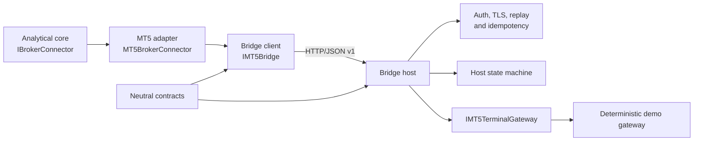
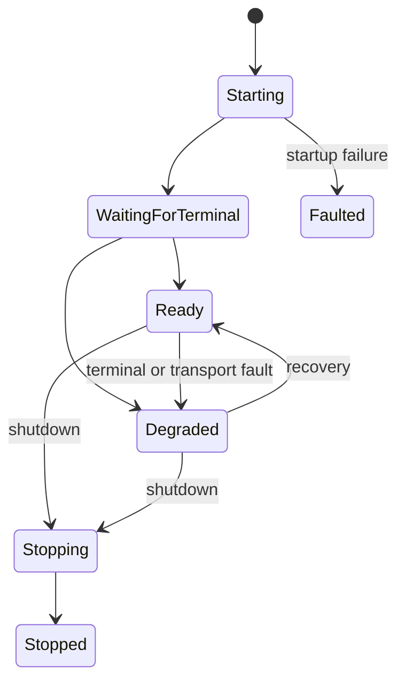

# Bridge Architecture

The bridge is an infrastructure boundary owned by the MT5 adapter area. The
contracts assembly is deliberately smaller than both sides and has no project
reference. It contains protocol values only; it does not contain ASP.NET,
serialization infrastructure, EF Core or broker-domain types.

The client owns transport deadlines, request concurrency, retry policy and
client state. The host owns server-side authentication, clock and deadline
validation, replay protection, idempotency records, host lifecycle and the
terminal gateway. Neither side shares mutable state with the analytical core.

## State machines

Client states are `Disconnected`, `Connecting`, `Handshaking`, `Ready`,
`Degraded`, `Reconnecting`, `Faulted` and `Closed`. Host states are
`Starting`, `WaitingForTerminal`, `Ready`, `Degraded`, `Stopping`, `Stopped`
and `Faulted`. State is explicit and synchronized; there is no boolean
`IsConnected` contract.

## Dependency rule

The bridge host may reference only the neutral contracts and observability
abstractions. The bridge client may reference the existing MT5 adapter,
neutral contracts and observability abstractions. No bridge type is added to
`TradeMind.Api`, AI modules, persistence modules or the broker-neutral domain.
