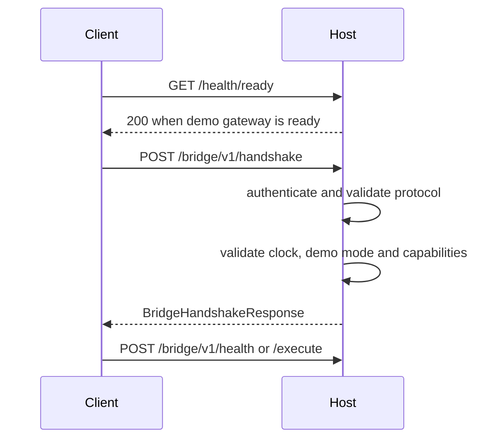

# Handshake

The client first calls `GET /health/ready`, then posts a handshake containing
the protocol version, adapter version, demo requirement, account environment,
client time, required capabilities and request metadata.

The response reports negotiated protocol, bridge and adapter versions,
environment, account environment, terminal state, terminal version, server
time, clock skew, capabilities and a normalized error when negotiation fails.
Unknown capabilities are rejected rather than silently ignored. A client
cannot use handshake success to enable live mode because both execution
layers enforce demo-only behavior independently.
