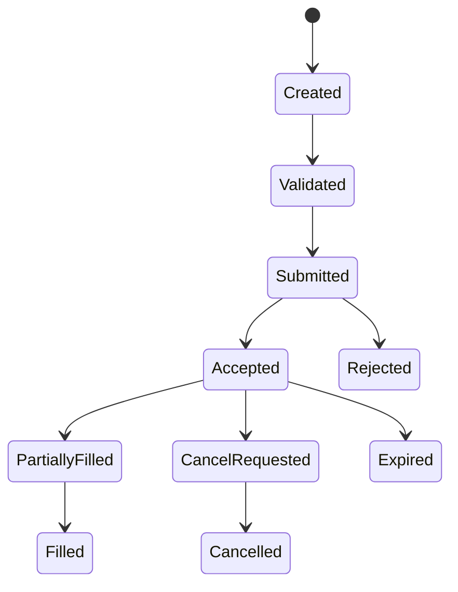

# Orders

Les types supportés sont `Market`, `Limit`, `Stop` et `StopLimit`, avec les côtés `Buy` et `Sell`. Les statuts suivent le cycle neutre de création, validation, soumission, acceptation, remplissage, annulation ou rejet.

Le connecteur in-memory remplit immédiatement les ordres Market à un prix déterministe issu de la spécification de l’instrument. Les ordres Limit et Stop restent acceptés sans inventer de fill.
