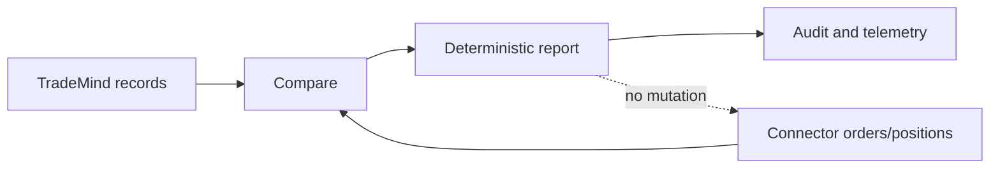

# Reconciliation

La réconciliation lit les ordres et positions du connecteur, trie les observations et produit un `BrokerReconciliationReport` immuable. Elle peut signaler statut, quantité, prix, fill, doublon, position ou fraîcheur incohérents.

Elle ne ferme pas d’ordre, ne modifie pas de position et ne déclenche aucun self-healing. Un connecteur sans capacité `Reconciliation` retourne une erreur normalisée `UnsupportedCapability`.

