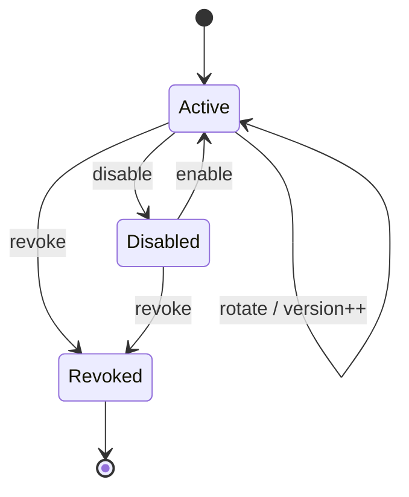

# API Keys

API keys are scoped to an organization and tenant. Their durable record contains
the public key identifier, algorithm, salt, derived hash, permission set,
status, expiry, key version, concurrency version and last-used timestamp. It
does not contain the raw credential.

The lifecycle is:

Revocation is terminal. Expired, disabled, revoked and permissionless keys do
not authenticate. Create, read, rotate, revoke, disable and enable operations
require explicit permissions and tenant ownership. Active-key limits are
checked in the application and the database concurrency version protects
updates across multiple API instances. PostgreSQL unique indexes protect public
identifiers.

The secret format includes a non-secret environment marker and public identifier
followed by a random secret. It is accepted only within bounded input length;
no secret is present in configuration or source control.
