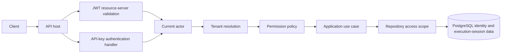

# Identity Architecture

Identity follows Clean Architecture inside the modular monolith. Domain types
are immutable records or value objects and contain no EF Core, HTTP, JWT or
ASP.NET references. Application contracts expose the minimum information needed
by an authorization boundary. Infrastructure adapts those contracts to JWT and
PostgreSQL. The API host owns middleware, authentication handlers, endpoint
policies and OpenAPI composition.

`Identity.Domain` is the innermost boundary. `Identity.Application` may depend
only on the domain and framework-neutral abstractions. `Identity.Infrastructure`
may depend on Application and Domain. No analytical domain module depends on
Identity, and endpoints consume application contracts rather than persistence
entities.

Authentication and authorization are deliberately separate. Authentication
produces an immutable `ActorIdentity`; authorization evaluates a permission for
that actor and never treats an arbitrary role or claim as a permission without
an explicit mapping.
