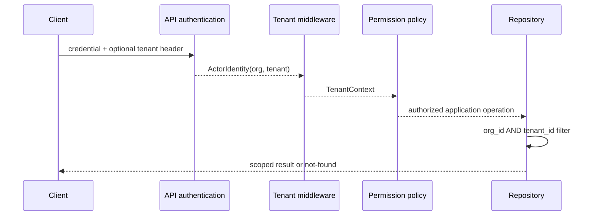

# Multi-Tenancy

An authenticated actor carries an organization and tenant scope. The API host
resolves that scope from the validated credential and may accept
`X-TradeMind-Tenant-ID` only when it matches the credential. A platform
administrator override is disabled by default and must be enabled explicitly.
The selected tenant is echoed through the configured response header.

Application services require a resolved `TenantContext` for tenant-owned
identity operations. Execution-session persistence applies an access scope at
the query boundary for reads, search, timeline and updates. This prevents an
ID supplied by another tenant from becoming a write side channel. Existing
rows migrated from earlier releases receive the `system` organization and
tenant values and therefore remain explicit rather than silently inheriting a
requesting tenant.

