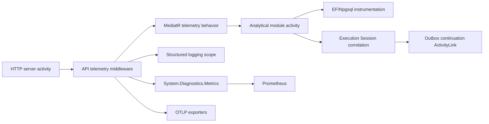

# Observability Architecture

Observability is composed in three layers:

1. `TradeMind.Observability.Abstractions` contains immutable context, stable names and small interfaces.
2. `TradeMind.Observability` owns ActivitySource, Meter, context flow, logging scopes, options validation and the MediatR behavior.
3. `TradeMind.Api` enriches the existing HTTP activity with authentication, tenant, execution-session and correlation metadata.

The API middleware enriches the server span created by ASP.NET Core instrumentation. It does not create a second HTTP span. Application operations create internal spans with stable names and bounded tags. Request and response payloads are never serialized into telemetry.

The durable business correlation is the execution-session identifier. A single session can span multiple HTTP traces, and asynchronous replay/outbox work uses a link instead of inventing a false parent-child relationship.
