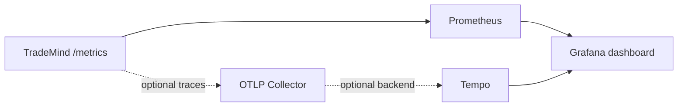

# Grafana

The local dashboard is deliberately small and operational: request rate, error rate, pipeline duration and execution-session failures. It uses Prometheus queries against bounded labels and does not display tenant or actor identifiers.

Dashboard JSON and provisioning files live under `observability/grafana`. They are configuration assets, not runtime dependencies. The dashboard is not production-tuned alerting and does not send notifications.
