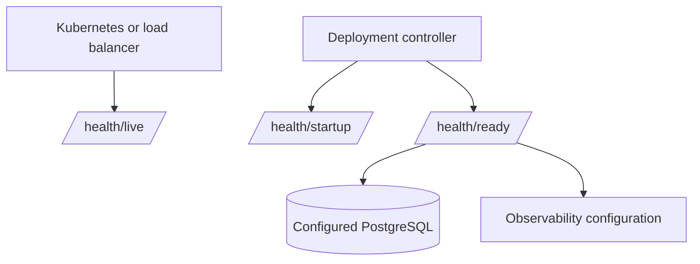

# Health Checks

`/health/live` is a process probe and never opens a database connection. `/health/ready` runs configured dependency checks for KnowledgeHub, Market Connectors, Execution Sessions and observability. Its response is intentionally minimal: status, check name and UTC timestamp. `/health/startup` reports whether startup migrations and initialization have completed.

Connection strings, stack traces, SQL errors, exporter headers and detailed dependency payloads are never returned anonymously. Detailed operational access remains an authorized platform concern and is not enabled by default.
