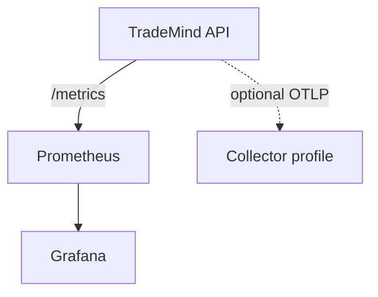

# Local Observability Stack

The repository includes an optional local stack in `docker-compose.observability.yml` with Prometheus and Grafana. It has no credentials, no cloud endpoints and no live trading dependencies. The API itself remains runnable without Docker.

Start it with `docker compose -f docker-compose.observability.yml config` to validate the file, then run it only when local dashboards are useful. The compose file does not start a broker, MT5, PostgreSQL or an external LLM.
