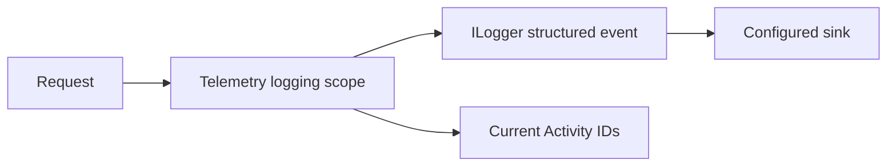

# Structured Logging

TradeMind keeps `Microsoft.Extensions.Logging`. The telemetry middleware opens one structured scope for the request after authentication, tenant resolution and execution-session validation.

The scope contains correlation, trace, span, execution-session, organization, tenant, actor type, request, endpoint, module, operation, service name, service version and environment properties. Values are bounded and are emitted as properties rather than concatenated into messages.

Logs never contain Authorization headers, raw API keys, JWTs, cookies, request bodies, prompts, complete trading payloads or full SQL parameters. Expected validation and authorization failures are not logged as internal errors. Production database configuration keeps sensitive EF logging disabled.

