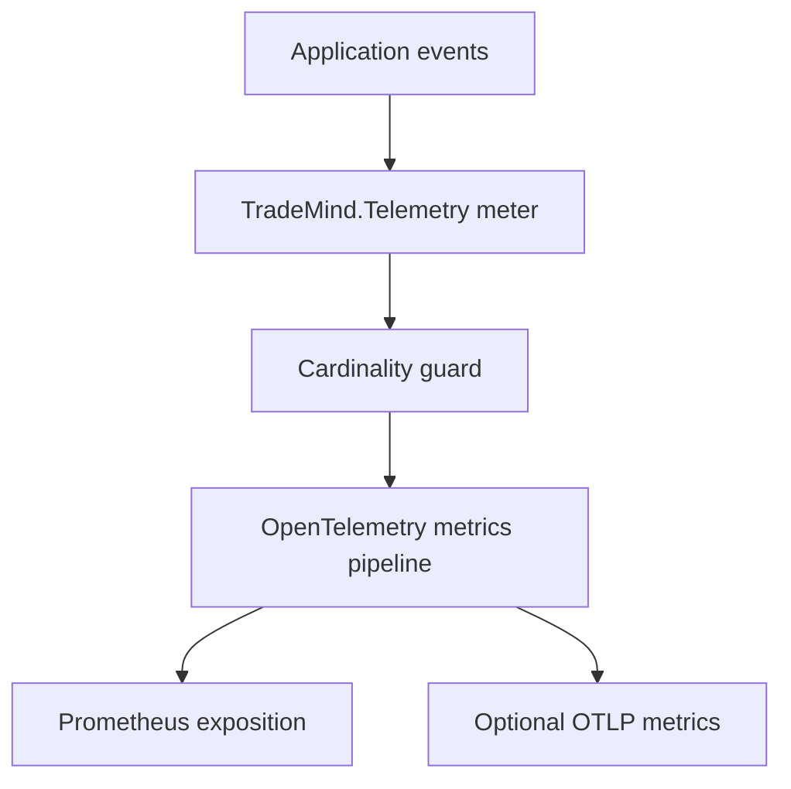

# Metrics

The stable meter is `TradeMind.Telemetry`, version `1.0.0`. Duration histograms use seconds (`s`). Counters use natural event units such as requests, sessions, messages or failures.

Counters cover API requests/errors, authentication, authorization, rate limits, execution-session lifecycle, pipeline operations, Paper Trading, outbox processing and durable idempotency. Histograms cover API, pipeline, session, Paper Trading, replay, database and outbox durations. The active execution-session gauge is bounded to `0..100000`.

Allowed dimensions are `module`, `operation`, `stage`, `outcome`, `status_class`, `authentication_method`, `actor_type`, `environment` and `service_version`.

Tenant IDs, actor IDs, user IDs, execution-session IDs, correlation IDs, raw paths with identifiers, exception messages and instrument symbols are intentionally excluded from metric labels. They may be present as bounded trace or log metadata when authorized.
