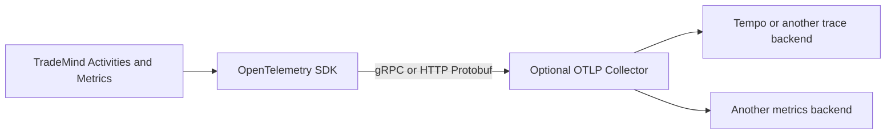

# OTLP

The OTLP exporter is optional and supports `Grpc` and `HttpProtobuf`. TradeMind configures an endpoint and headers only inside the process. No collector is required for startup or request handling, and exporter availability is not treated as a business dependency.

Collector delivery is not claimed by local tests. The repository only validates configuration and application behavior with exporters disabled or with an in-process listener.
