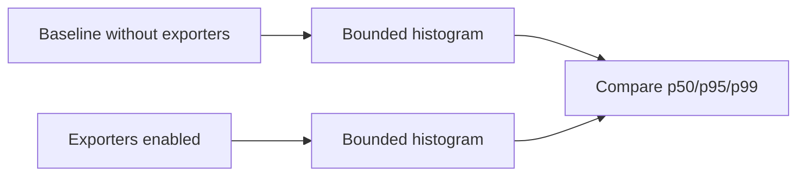

# Performance Comparison

The repository records operation duration using `Stopwatch.GetTimestamp()` and exports seconds. Instrumentation never serializes request or response payloads, and disabled telemetry returns through the same application paths without exporter calls.

The first production baseline should compare p50, p95 and p99 API and pipeline histograms before and after enabling exporters. This sprint intentionally does not claim a production latency result or a collector delivery benchmark.

