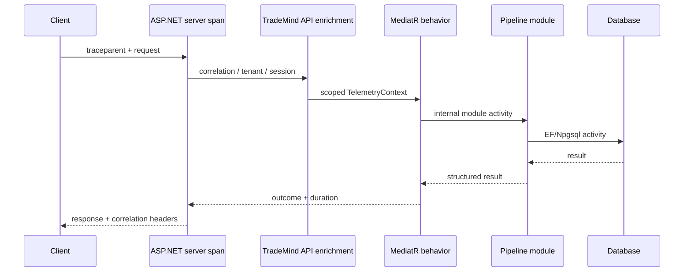

# Tracing

Activity source names are stable and created once per source name:

`TradeMind.Api`, `TradeMind.Identity`, `TradeMind.ExecutionSessions`, `TradeMind.Persistence`, `TradeMind.MarketConnectors`, `TradeMind.MarketContext`, `TradeMind.Experts`, `TradeMind.Consensus`, `TradeMind.TradingDecisions`, `TradeMind.Risk`, `TradeMind.TradingPlans`, `TradeMind.TradingWorkspace`, `TradeMind.TradingAssistant`, `TradeMind.PaperTrading`, `TradeMind.Outbox` and `TradeMind.Replay`.

The W3C `traceparent` and `tracestate` headers are handled by ASP.NET Core and HttpClient instrumentation. The middleware adds safe TradeMind tags to the existing server Activity. MediatR operations use a deterministic name derived from the request namespace and type.

Expected 4xx validation and authorization outcomes are marked as rejected outcomes and are not recorded as internal exceptions. Genuine failures set the Activity status to Error and record only the exception type, not its message or payload.
