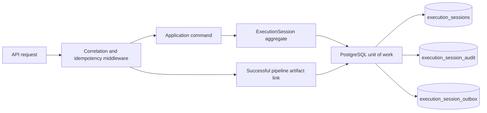

# Persistence and Execution Sessions

Execution Sessions are the durable correlation boundary for one analytical
pipeline run. They are intentionally separate from the business modules that
produce market context, analysis, consensus, decisions, plans, workspaces and
paper-trading results.

## Responsibilities

- Persist the lifecycle and identity of a run.
- Link versioned, replayable artifacts without copying their business models.
- Record a chronological timeline and append-only audit entries.
- Publish durable domain events through a transactional outbox.
- Enforce optimistic concurrency with PostgreSQL.
- Provide durable idempotency for API commands.
- Build a deterministic replay manifest from stored artifact references.

The execution session aggregate does not execute a trade, call a broker, call a
model provider or calculate a trading decision. It records the result of those
independent modules after they have completed.

## Projects

| Project | Responsibility |
| --- | --- |
| `TradeMind.ExecutionSessions.Domain` | Aggregate, value objects and lifecycle invariants |
| `TradeMind.ExecutionSessions.Application` | Commands, queries, ports, DTOs and replay policy |
| `TradeMind.ExecutionSessions.Infrastructure` | EF Core, Npgsql, migrations, repository, outbox and durable idempotency |
| `TradeMind.Api` | HTTP contracts, endpoint mapping and correlation header middleware |

## Flow

The analytical request and its persistence update are not one distributed
transaction. A successful pipeline response is captured and linked after the
response completes. That link is durable and observable, but a link failure
does not roll back the already completed analytical response.

## Configuration

Set `TradeMind:Persistence:Provider` to `PostgreSql` and provide the configured
connection string name. Production deployments apply the checked-in EF
migrations through deployment tooling. `ApplyMigrationsOnStartup` is an
explicit opt-in for controlled environments; it is disabled by default.

See [execution sessions](execution-sessions.md), [concurrency](concurrency.md)
and [migrations](migrations.md) before enabling the module in a host.
