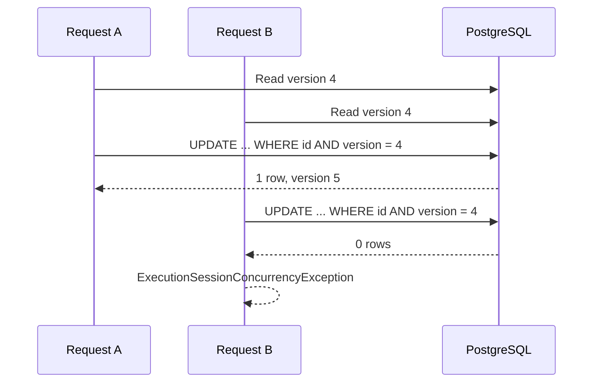

# Concurrency

Execution Sessions use optimistic concurrency. The aggregate exposes a
monotonic `ConcurrencyVersion`; every successful domain mutation increments it.
The persistence row stores the same value as a PostgreSQL-backed EF Core
concurrency token.

No process-local lock or static semaphore is used. Multiple pods therefore
share the same correctness guarantee. The API maps a conflict to HTTP 409 and
the caller must reload the session before retrying with a new expected version.

Aggregate, audit and outbox writes occur in one database transaction. A failed
transaction is rolled back, so an audit event cannot claim a transition that
was not persisted.
