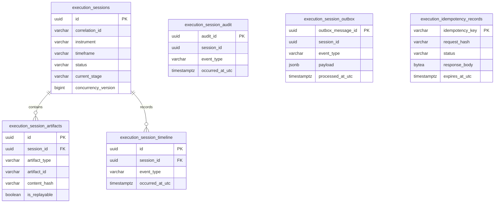

# Database Schema

The `ExecutionSessionsDbContext` owns six tables in PostgreSQL. The migration
uses explicit `snake_case` names and JSONB only for bounded metadata and event
payloads.

Foreign keys cascade artifact and timeline rows when a session is deleted.
Audit and outbox rows are deliberately append-oriented and retain their
session ID as a durable correlation value without making event publication
depend on a live aggregate query.

Indexes cover correlation, status/start time, instrument/start time, current
stage, artifact identity, timeline/audit ordering, pending outbox messages and
idempotency expiry. Artifact identity is unique per session and artifact type.
