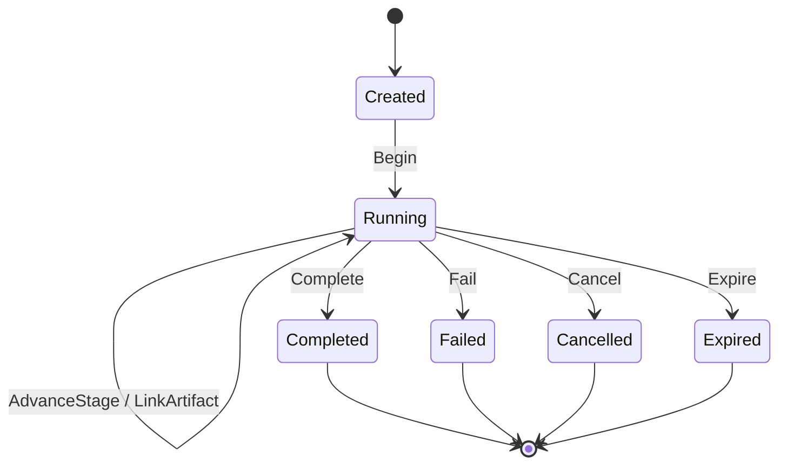

# Execution Session Model

An `ExecutionSession` is a versioned aggregate identified by a stable session
ID and a correlation ID. It carries the instrument, timeframe, tenant, user,
trigger, core/API versions and a bounded metadata dictionary.

## Lifecycle

The pipeline stages are ordered from `MarketContext` through `PaperTrading` and
then `Completed`. Stage regression, terminal mutation, duplicate artifact
identity and non-monotonic timestamps are rejected by the domain model.

## Identity and isolation

The optional tenant and user values are persisted on the aggregate and are
included in the API resource. Search, retrieval, timeline and updates are
scoped by a provider-neutral access scope at the repository query boundary. The
API host supplies that scope from the authenticated tenant context, so a
cross-tenant identifier cannot become a read or write side channel. Existing
rows migrated from earlier releases receive explicit `system` ownership values.

## Artifacts

Artifacts contain only a typed reference, schema version, creation time,
content hash, replayability flag and optional storage reference. The aggregate
does not embed large analytical payloads. This keeps session rows bounded and
allows module-specific result schemas to evolve independently.
