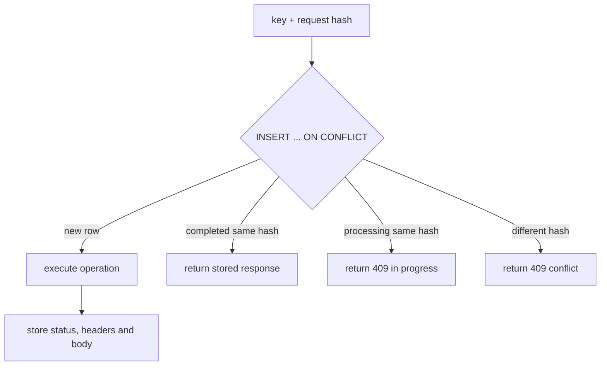

# Durable Idempotency

The API requires `Idempotency-Key` for create and cancel operations. With
PostgreSQL persistence configured, the API middleware delegates to
`PostgreSqlIdempotencyStore`.

The store inserts a `Processing` record using the unique idempotency key. The
unique constraint is the multi-pod coordination mechanism:

The request hash must match for a replay. A failed operation removes the
processing marker so a later retry can execute. Completed records expire using
the configured `TradeMind:Persistence:IdempotencyTtlMinutes` value. No in-memory
state is used for the PostgreSQL path; the existing in-memory store remains a
safe development fallback when persistence is intentionally disabled.
