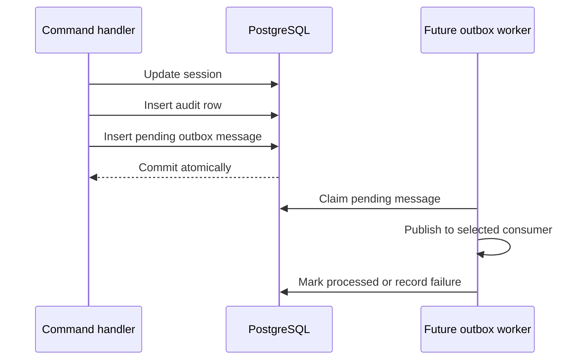

# Transactional Outbox

Each command that mutates a session writes an outbox message in the same
transaction as the aggregate and audit row.

Sprint 25 persists and indexes pending messages but does not introduce a
broker, worker or external delivery protocol. Processing is therefore a future
platform concern. Consumers must be idempotent and use the outbox message ID
as their deduplication key when delivery is implemented.
