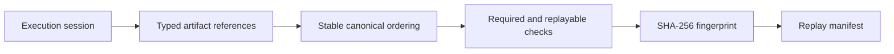

# Replay Manifest

The replay endpoint returns a deterministic manifest rather than rerunning a
pipeline. It orders linked artifacts by stage, artifact type, artifact ID and
creation timestamp, records schema versions and original timestamps, and
computes a SHA-256 fingerprint over canonical reference data.

Required artifacts for a completed session are the Market Context, Trading
Plan and Trading Workspace references. Missing or non-replayable references
make the manifest non-replayable and are returned as explicit reasons. The
manifest never invents a result or silently substitutes a newer artifact.

Actual replay execution, external side effects and broker interaction are out
of scope. A future replay service can consume the manifest and resolve the
referenced immutable artifact payloads through a separate storage contract.
